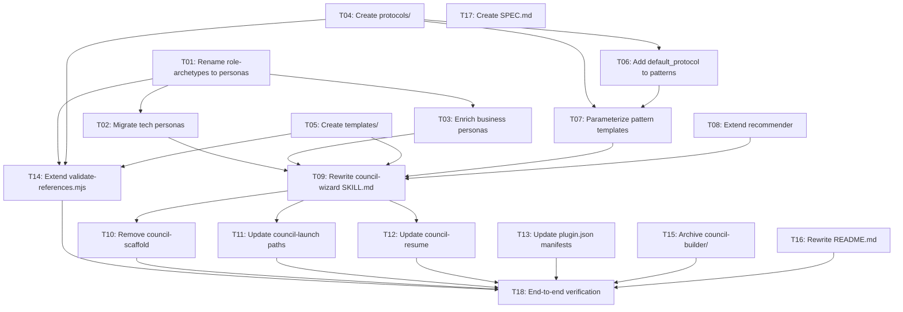

# Council Plugin -- Implementation Backlog

Ordered migration tasks for the unified council-plugin. Each task has acceptance criteria and dependency tracking. Reference: [SPEC.md](SPEC.md) for design details, [UNIFICATION-PLAN.md](UNIFICATION-PLAN.md) for historical context.

---

## Dependency graph

---

## Tasks

### T01: Rename `references/role-archetypes/` to `references/personas/`

**Description**: Rename the directory and update all internal references across skill files, scripts, and documentation.

**Files**:
- `references/role-archetypes/` -> `references/personas/`
- All files that reference `role-archetypes` or `references/role-archetypes`

**Acceptance criteria**:
- [x] `references/personas/` exists with all 12 business persona files
- [x] `references/role-archetypes/` no longer exists
- [x] `grep -r "role-archetypes" --include="*.md" --include="*.mjs" --include="*.json"` returns 0 hits in non-archived files
- [x] `git mv` used to preserve history

**Depends on**: none

**Status**: DONE

---

### T02: Migrate 6 tech personas from council-builder to `references/personas/`

**Description**: Copy the 6 tech personas and the custom template from `council-builder/.claude/skills/council-builder/persona-library/` into `references/personas/`. Adapt each to the unified format: add YAML frontmatter with `domains`, `fits_patterns`, `category: tech`, and `domain-context-sections`.

**Files**:
- Source: `council-builder/.claude/skills/council-builder/persona-library/` (architect, product-analyst, qa-strategist, security-engineer, devops-engineer, ux-designer, _custom-template)
- Target: `references/personas/`

**Acceptance criteria**:
- [x] 6 tech persona files exist in `references/personas/`
- [x] `references/personas/_custom-template.md` exists
- [x] Each tech persona has valid YAML frontmatter with all required fields: `id`, `name`, `category: tech`, `domains`, `fits_patterns`, `domain-context-sections`
- [x] All 10 mandatory sections present in each persona (see SPEC.md section 3.1)
- [x] Domain-specific content (e.g., distributed-playground references) stripped from persona files
- [x] `validate-references` passes after T14

**Depends on**: T01

**Status**: DONE

---

### T03: Enrich 12 business personas with unified format sections

**Description**: For each business persona in `references/personas/`, add the structured sections from the unified format: Identity, Core Competencies, Behavior in the Council, What You Care About, What You Defer to Others, Vote Guidelines, Quality Checklist, and `domain-context-sections` in frontmatter. Existing content (Role description, Baseline skill template, Typical questions, Customization slots) is preserved.

**Files**:
- All 12 files in `references/personas/` with `category: business`

**Acceptance criteria**:
- [x] All 12 business personas have all 10 mandatory sections from the unified format
- [x] `category: business` in frontmatter for each
- [x] `domain-context-sections` added to each persona's frontmatter, matching the vocabulary in SPEC.md section 3.3
- [x] Existing content (Role description, Baseline skill, Typical questions, Customization slots) preserved
- [x] `validate-references` passes after T14

**Depends on**: T01

**Status**: DONE

---

### T04: Create `references/protocols/` with 3 protocols + custom template

**Description**: Create the protocols directory with standalone protocol definitions. Migrate `deliberative-voting.md` from council-builder (updating output paths from `council-log/` to `Sessions/`). Create `adversarial-debate-protocol.md` and `convergent-investigation.md` as new protocols derived from their respective patterns. Migrate `_custom-template.md` from council-builder.

**Files**:
- `references/protocols/deliberative-voting.md` -- migrated from `council-builder/.claude/skills/council-builder/protocols/deliberative-voting.md`
- `references/protocols/adversarial-debate-protocol.md` -- new
- `references/protocols/convergent-investigation.md` -- new
- `references/protocols/_custom-template.md` -- migrated from `council-builder/.claude/skills/council-builder/protocols/_custom-template.md`

**Acceptance criteria**:
- [x] 4 files exist in `references/protocols/`
- [x] `deliberative-voting.md` has all sections from the council-builder version (Configuration, Vote Semantics, Response Format, Consensus Rules, Escalation Rules, Deliberative Cycle, Output Formats, Behavioral Rules)
- [x] All output paths reference `Sessions/` not `council-log/`
- [x] `adversarial-debate-protocol.md` defines Position/Evidence/Counter-argument structure with FAVOR_A, FAVOR_B, SPLIT labels
- [x] `convergent-investigation.md` defines SUPPORTED, WEAK, REFUTED, INCONCLUSIVE hypothesis votes
- [x] `_custom-template.md` has comments explaining each required section

**Depends on**: none

**Status**: DONE

---

### T05: Create `references/templates/` with generation skeletons

**Description**: Create the templates directory with generation skeletons migrated from council-builder. Rename `.hbs` to `.tmpl`. Add a domain context template from council-builder's `_context-template.md`. Do NOT include a CLAUDE.md injection template (protocol goes in agent files per SPEC.md section 2.3).

**Files**:
- `references/templates/coordinator.md.tmpl` -- from `council-builder/.claude/skills/council-builder/templates/coordinator.md.hbs`
- `references/templates/teammate.md.tmpl` -- from `council-builder/.claude/skills/council-builder/templates/persona.md.hbs`
- `references/templates/domain-context.md.tmpl` -- from `council-builder/.claude/skills/council-builder/domain-contexts/_context-template.md`

**Acceptance criteria**:
- [x] 3 template files exist in `references/templates/`
- [x] No `.hbs` references remain in any non-archived file
- [x] No CLAUDE.md injection template exists
- [x] `coordinator.md.tmpl` contains all variables from SPEC.md section 4.4 coordinator table
- [x] `teammate.md.tmpl` contains all variables from SPEC.md section 4.4 teammate table
- [x] `domain-context.md.tmpl` includes both business and tech section vocabularies

**Depends on**: none

**Status**: DONE

---

### T06: Add `default_protocol` frontmatter to all 7 pattern files

**Description**: Each pattern in `references/patterns/` gets `default_protocol: <id>` in its YAML frontmatter, per the pairing table in SPEC.md section 4.3.

**Files**:
- `references/patterns/hub-and-spoke.md` -- `default_protocol: deliberative-voting`
- `references/patterns/swarm.md` -- `default_protocol: convergent-investigation`
- `references/patterns/adversarial-debate.md` -- `default_protocol: adversarial-debate-protocol`
- `references/patterns/map-reduce.md` -- `default_protocol: deliberative-voting`
- `references/patterns/plan-execute-verify.md` -- `default_protocol: deliberative-voting`
- `references/patterns/ensemble-voting.md` -- `default_protocol: deliberative-voting`
- `references/patterns/builder-validator.md` -- `default_protocol: deliberative-voting`

**Acceptance criteria**:
- [x] All 7 pattern files have `default_protocol` in YAML frontmatter
- [x] Values match SPEC.md section 4.3 table exactly
- [x] `validate-references` checks this field after T14

**Depends on**: T04

**Status**: DONE

---

### T07: Parameterize pattern coordinator/teammate templates with protocol variables

**Description**: In each pattern's coordinator and teammate prompt templates, replace hardcoded vote semantics with protocol variable placeholders: `{{VOTE_OPTIONS}}`, `{{CONSENSUS_RULE}}`, `{{REJECTION_RULE}}`, `{{RESPONSE_FORMAT}}`, `{{BEHAVIORAL_RULES}}`. This decouples patterns from specific protocol details.

**Files**:
- All 7 files in `references/patterns/`

**Acceptance criteria**:
- [x] No pattern file contains hardcoded vote option lists (e.g., `PROPOSE | OBJECT | APPROVE | ABSTAIN | REJECT` as literal text in templates)
- [x] All coordinator prompt templates use `{{VOTE_OPTIONS}}`, `{{CONSENSUS_RULE}}`, `{{REJECTION_RULE}}`
- [x] All teammate prompt templates use `{{VOTE_OPTIONS}}`
- [x] Existing recommender signals, HITL checkpoints, and output mapping sections unchanged

**Depends on**: T04, T06

**Status**: DONE

---

### T08: Extend recommender questions for broader pattern coverage

**Description**: Update `references/recommender/questions.md` to cover adversarial-debate and builder-validator more explicitly. Ensure the question tree can route to all 7 patterns without dead ends.

**Files**:
- `references/recommender/questions.md`

**Acceptance criteria**:
- [x] Recommender question tree can route to all 7 patterns
- [x] No pattern is unreachable from any answer path
- [x] adversarial-debate and builder-validator have explicit routing (not just tie-breaker mentions)
- [x] Still limited to 2-3 questions maximum

**Depends on**: none

**Status**: DONE

---

### T09: Rewrite `skills/council-wizard/SKILL.md` to unified 5-phase flow

**Description**: Rewrite the wizard skill to implement the 5-phase flow from SPEC.md section 5. The wizard handles both business and tech scenarios, references the unified directory structure, and absorbs scaffold logic into Phase 5. No reference to `council-scaffold` as a separate skill.

**Files**:
- `skills/council-wizard/SKILL.md`

**Acceptance criteria**:
- [x] SKILL.md has exactly 5 phases matching SPEC.md section 5
- [x] Phase 1: scenario intake + context discovery (business docs OR codebase scan)
- [x] Phase 2: pattern + protocol selection (hybrid recommender)
- [x] Phase 3: agent composition (library match + dynamic generation)
- [x] Phase 4: HITL confirmation (inline only, no configuration needed)
- [x] Phase 5: generate all artifacts + launch offer (scaffold logic embedded)
- [x] References `references/personas/`, `references/protocols/`, `references/templates/`
- [x] No reference to `council-scaffold` as a separate skill
- [x] Agent files generated at `.claude/agents/` not `council/agents/`
- [x] Works for both business and tech scenarios (not "non-technical" only)
- [x] Cowork-first language (inline HITL as default)
- [x] Handles failure modes from SPEC.md section 12: empty `Docs/`, skill-creator failure (retry + archetype fallback)

**Depends on**: T02, T03, T05, T07, T08

**Status**: DONE

---

### T10: Remove `skills/council-scaffold/SKILL.md`

**Description**: Delete the scaffold skill file. Its logic is now in wizard Phase 5 (SPEC.md section 6.1).

**Files**:
- `skills/council-scaffold/SKILL.md` -- delete
- `skills/council-scaffold/` directory -- delete

**Acceptance criteria**:
- [x] `skills/council-scaffold/` does not exist
- [x] No other skill file references `council-scaffold`
- [x] `grep -r "council-scaffold" --include="*.md"` returns only hits in SPEC.md, TODO.md, and UNIFICATION-PLAN.md

**Depends on**: T09

**Status**: DONE

---

### T11: Update `skills/council-launch/SKILL.md` paths

**Description**: Update agent file paths from `council/agents/` to `.claude/agents/` throughout the launch skill.

**Files**:
- `skills/council-launch/SKILL.md`

**Acceptance criteria**:
- [x] No reference to `council/agents/` in the file
- [x] All agent paths use `.claude/agents/`
- [x] Precondition checks reference `.claude/agents/coordinator.md` and `.claude/agents/<slug>.md`
- [x] Kickoff prompt structure references `.claude/agents/` paths
- [x] Handles launch-time failure modes from SPEC.md section 12: missing scaffold files (explicit error), Agent Teams unavailability (surface clear error + guidance)

**Depends on**: T09

**Status**: DONE

---

### T12: Update `skills/council-resume/SKILL.md` for consistency

**Description**: Verify and update session paths and agent references to be consistent with the new layout defined in SPEC.md section 6.4.

**Files**:
- `skills/council-resume/SKILL.md`

**Acceptance criteria**:
- [x] Paths consistent with SPEC.md section 6.4
- [x] Agent file references use `.claude/agents/` if mentioned
- [x] Session detection logic matches the output file names from all patterns
- [x] No stale references to old paths
- [x] Handles resume-time failure modes from SPEC.md section 12: partial/incomplete round files (detect, offer discard or resume)

**Depends on**: T09

**Status**: DONE

---

### T13: Update `plugin.json` manifests

**Description**: Update both plugin manifest files to reflect the unified identity: name -> `council-plugin`, description mentions business + tech + Cowork, keywords include `cowork`.

**Files**:
- `plugin.json`
- `.claude-plugin/plugin.json`

**Acceptance criteria**:
- [x] Both files have `"name": "council-plugin"`
- [x] Description mentions both business and technical users
- [x] Description mentions Cowork
- [x] Keywords array includes `"cowork"`
- [x] Keywords array includes both `"business"` and `"tech"`

**Depends on**: none

**Status**: DONE

---

### T14: Extend `scripts/validate-references.mjs`

**Description**: Add validation for new directories and update references from `role-archetypes` to `personas`.

**Files**:
- `scripts/validate-references.mjs`

**Acceptance criteria**:
- [x] Validates `references/personas/` (renamed from `role-archetypes`): required frontmatter fields (`id`, `name`, `category`, `domains`, `fits_patterns`, `domain-context-sections`), all 10 mandatory sections present
- [x] Validates `references/protocols/` (new): required sections (Configuration, Vote Semantics, Response Format, Consensus Rules, Escalation Rules, Deliberative Cycle, Output Formats, Behavioral Rules)
- [x] Validates `references/templates/` (new): required template variables present per SPEC.md section 4.4
- [x] Validates `default_protocol` field in pattern frontmatter
- [x] No reference to `role-archetypes` in the script
- [x] `npm run validate:references` passes on valid files and fails on missing required sections

**Depends on**: T01, T04, T05

**Status**: DONE

---

### T15: Delete `council-builder/`

**Description**: Delete the entire `council-builder/` directory. All useful content was already migrated into the unified plugin by T02–T05. No archive is needed.

**Files**:
- `council-builder/` -- deleted

**Acceptance criteria**:
- [x] `council-builder/` no longer exists at repo root

**Depends on**: none

**Status**: DONE

---

### T16: Rewrite `README.md`

**Description**: Rewrite the README for the unified plugin identity. See SPEC.md for the authoritative design reference. Key changes: no "business-only" framing, Cowork as first quick-start option, 4 skills (scaffold removed), layout table updated for new directories, agent paths at `.claude/agents/`, plugin name `council-plugin`.

**Files**:
- `README.md`

**Acceptance criteria**:
- [x] No mention of "non-technical" as exclusive audience
- [x] Mentions Cowork as primary target
- [x] Layout table matches SPEC.md section 2.1 (personas, protocols, templates directories)
- [x] Skills table shows 3 skills (wizard, launch, resume)
- [x] Agent paths use `.claude/agents/` not `council/agents/`
- [x] Plugin name is `council-plugin` not `council-skill`
- [x] Quick-start for both Cowork and CLI
- [x] Links to SPEC.md as design reference

**Depends on**: none

**Status**: DONE

---

### T17: Create `SPEC.md`

**Description**: Create the authoritative design and specification document for the unified system. Covers architecture, persona system, pattern/protocol system, wizard flow, session lifecycle, HITL integration, Cowork-first design, and resolved design decisions.

**Files**:
- `SPEC.md`

**Acceptance criteria**:
- [x] File exists with all sections from the outline in the implementation plan
- [x] Resolves all 8 open questions from UNIFICATION-PLAN.md section 12
- [x] Cowork mentioned throughout as primary target
- [x] Three-layer composition model documented
- [x] Complete template variable reference
- [x] All pattern-protocol pairings documented

**Depends on**: none

**Status**: DONE

---

### T19: Unify `2026-04-15-council-skill-design.md` into SPEC.md

**Description**: Merge unique, still-relevant content from the pre-unification design doc into SPEC.md, then delete the design doc. Content merged: target users (section 1.1), non-goals (section 1.2), Agent Teams constraints (section 1.3), error handling table (section 12), roadmap (section 13). Outdated content (8-phase wizard, old paths, council-skill naming) intentionally not merged.

**Files**:
- `SPEC.md` -- sections 1.1-1.3, 12, 13 added
- `docs/superpowers/specs/2026-04-15-council-skill-design.md` -- deleted
- `docs/superpowers/` -- removed (was empty apart from this file)
- `TODO.md` -- this task added; T09, T11, T12 updated with error handling references

**Acceptance criteria**:
- [x] `grep -r "2026-04-15-council-skill-design" .` returns no hits
- [x] SPEC.md has sections 1.1, 1.2, 1.3, 12, 13
- [x] Existing SPEC.md section numbers 2-11 unchanged (TODO.md cross-references intact)
- [x] `docs/superpowers/` does not exist

**Depends on**: T17

**Status**: DONE

---

### T18: End-to-end manual verification

**Description**: Run all validation commands and verify the migration is complete with no stale references.

**Files**: none (verification only)

**Acceptance criteria**:
- [x] `npm run validate:references` passes
- [x] `grep -r "role-archetypes" --include="*.md" --include="*.mjs" --include="*.json"` returns only hits in `docs/` (TODO.md, UNIFICATION-PLAN.md, SPEC.md -- historical migration context; no hits in non-docs files)
- [x] `grep -r "council-scaffold" --include="*.md"` returns only hits in SPEC.md, TODO.md, and UNIFICATION-PLAN.md
- [x] `grep -r "council/agents/" --include="*.md"` returns only hits in `council-models/` and `docs/` (historical context)
- [x] All pattern files have `default_protocol` in frontmatter
- [x] Both `plugin.json` files have `"name": "council-plugin"`

**Depends on**: T10, T11, T12, T13, T14, T15, T16

**Status**: DONE

---

## Suggested implementation order

Tasks with no dependencies can be started in parallel. A practical ordering:

**Wave 1** (no dependencies -- can all run in parallel):
- T04: Create protocols/
- T05: Create templates/
- T08: Extend recommender
- T13: Update plugin.json manifests
- T15: Archive council-builder/
- T17: Create SPEC.md (DONE)

**Wave 2** (depends on T01 or Wave 1 items):
- T01: Rename role-archetypes to personas
- T06: Add default_protocol to patterns (needs T04)

**Wave 3** (depends on Wave 2):
- T02: Migrate tech personas (needs T01)
- T03: Enrich business personas (needs T01)
- T07: Parameterize pattern templates (needs T04, T06)
- T14: Extend validate-references.mjs (needs T01, T04, T05)
- T16: Rewrite README.md (no hard dependency, but best after structure is finalized)

**Wave 4** (depends on Wave 3):
- T09: Rewrite council-wizard SKILL.md (needs T02, T03, T05, T07, T08)

**Wave 5** (depends on T09):
- T10: Remove council-scaffold
- T11: Update council-launch paths
- T12: Update council-resume

**Wave 6** (final):
- T18: End-to-end verification (needs T10, T11, T12, T13, T14, T15, T16)
